# 研发环境搭建

## github仓库
repo地址：https://github.com/WangYang-wy/Machine-Learning-Course

## 电脑及操作系统

MacOS Sierra

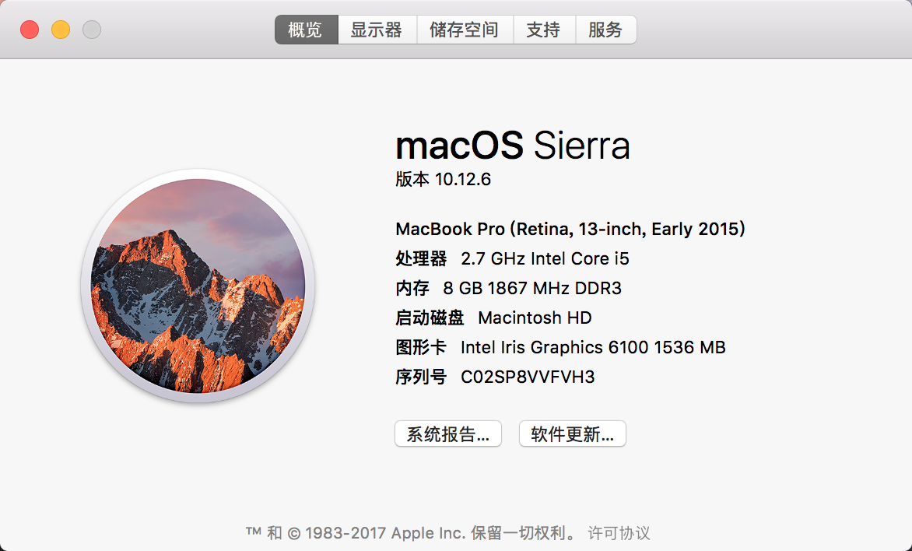

## 编译器

### PyCharm
- 官方网站：https://www.jetbrains.com/pycharm/
- PyCharm 2017.2.3
- Build #PY-172.3968.37, built on September 1, 2017
- Licensed to 阳 王
- Subscription is active until April 14, 2018
- For educational use only.
- JRE: 1.8.0_152-release-915-b11 x86_64
- JVM: OpenJDK 64-Bit Server VM by JetBrains s.r.o
- Mac OS X 10.12.6

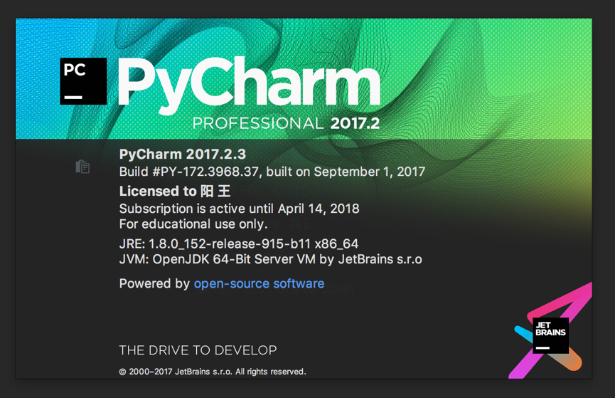


## 其他
- Xcode
  - 简介
  - MacOS上，在App Store中下载并安装。


- iTerm2
  - 官方网站：http://www.iterm2.com/
- Homebrew
  - 官方网站：https://brew.sh/
  - 在MacOS上需要安装Xcode才能成功安装Homebrew。
- Python3
  - 在iTerm2中输入`brew install python3`安装python3。

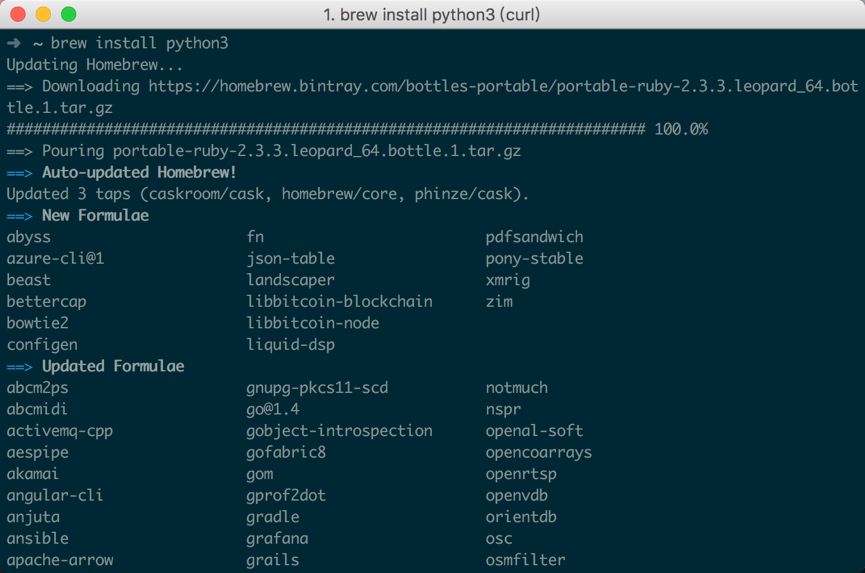
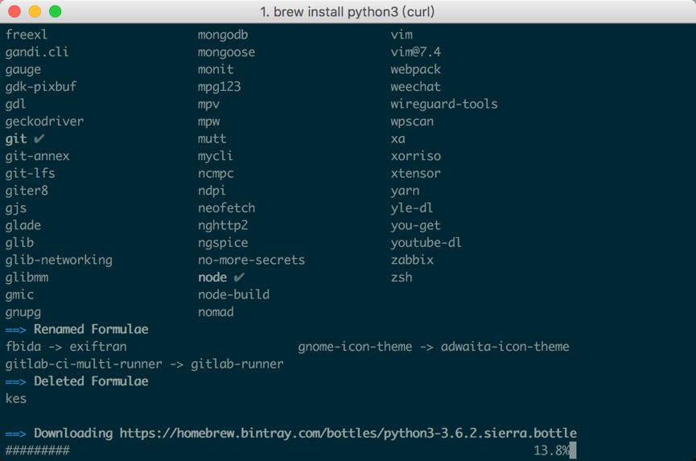
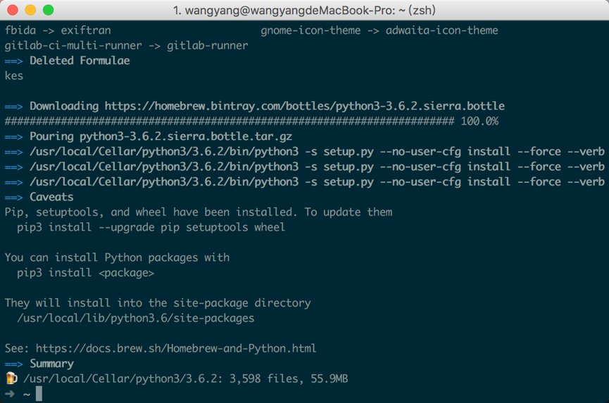

- NumPy
  - 在iTerm2中输入`pip3 install numpy`安装numpy包。

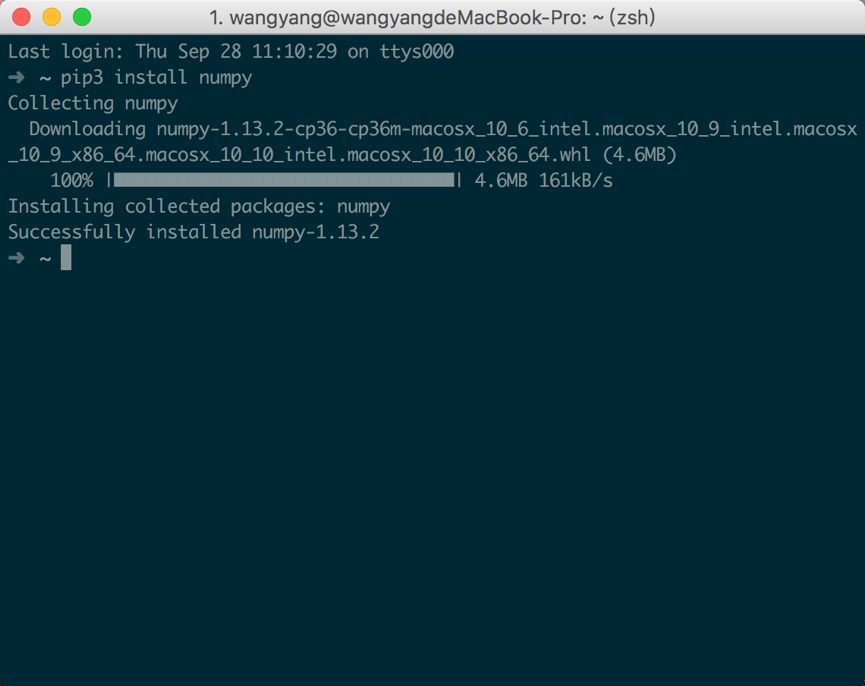

- SciPy
  - 在iTerm2中输入`pip3 install scipy`安装scipy包。

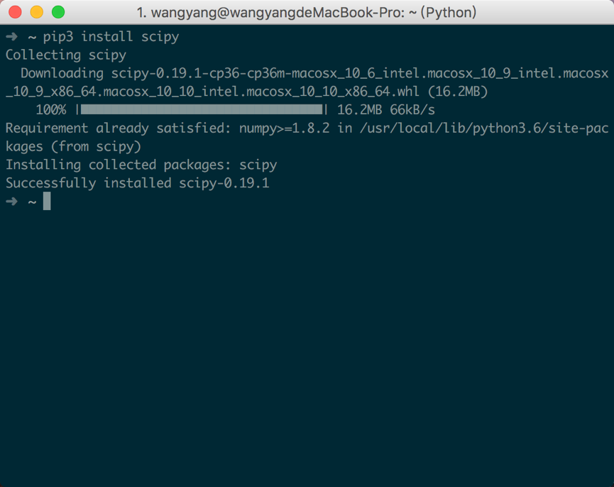
- xlrd
  - 在iTerm2中输入`pip3 install xlrd`安装xlrd包。

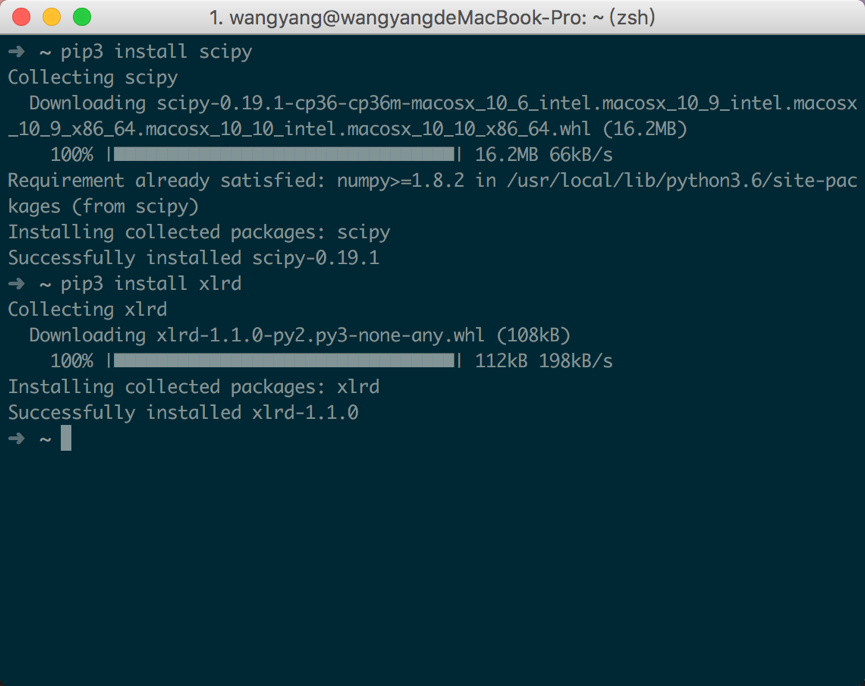
- TensorFlow
  - 在iTerm2中输入`pip3 install tensorflow`安装tensorflow包。

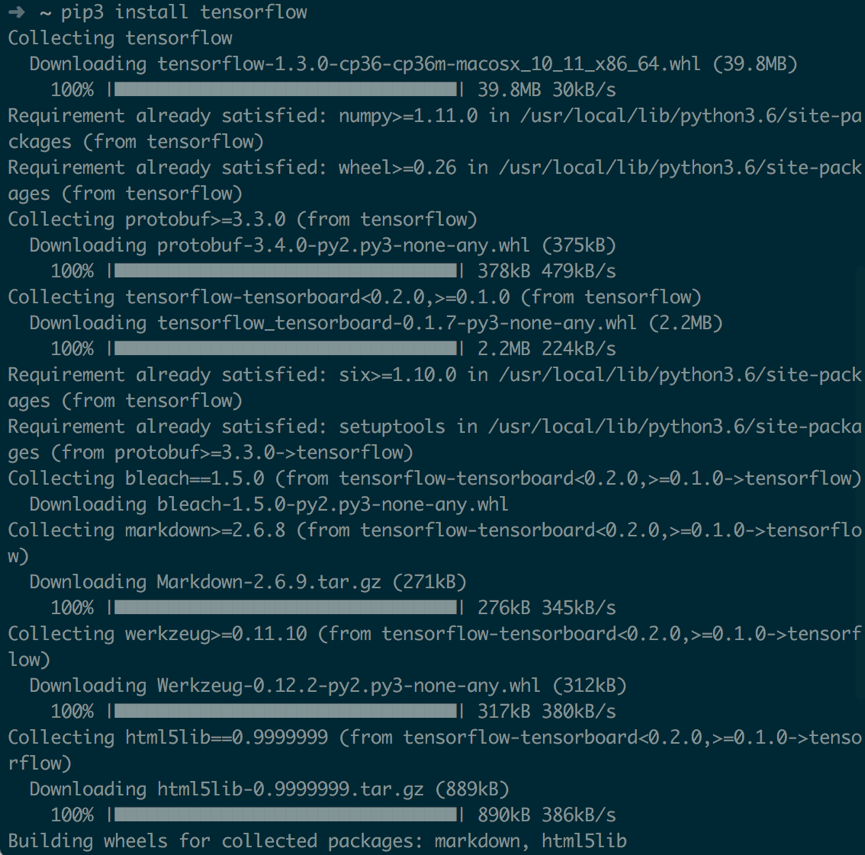
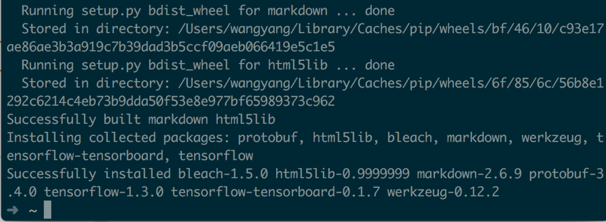
- matplotlib
  - 在iTerm2中输入`pip3 install numpy`安装numpy包。

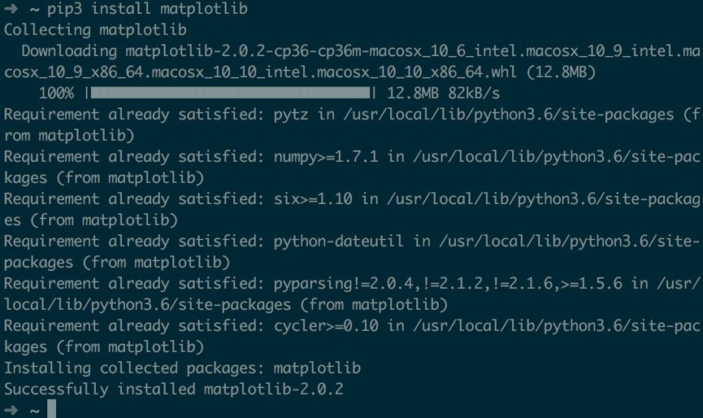

## 测试

### 测试包
在iTerm2中输入`pip3 list`查看已经安装的包。
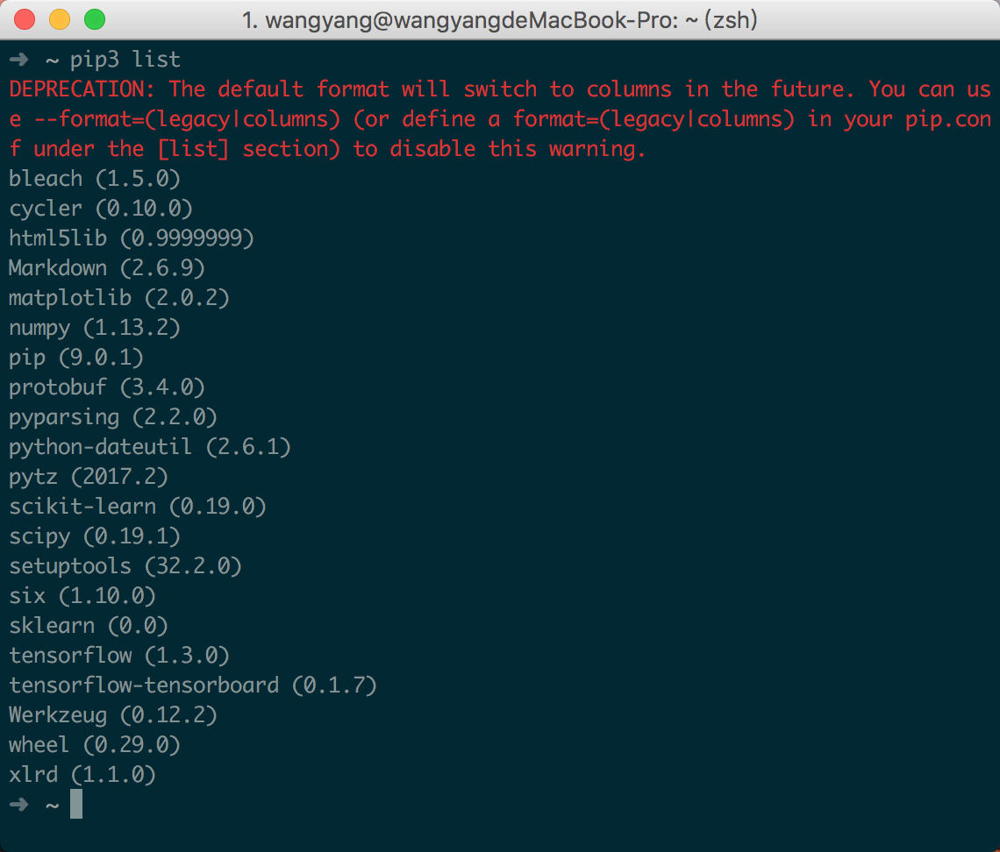

在iTerm2中输入`python3`，进入python3的交互式状态，然后`import`包。
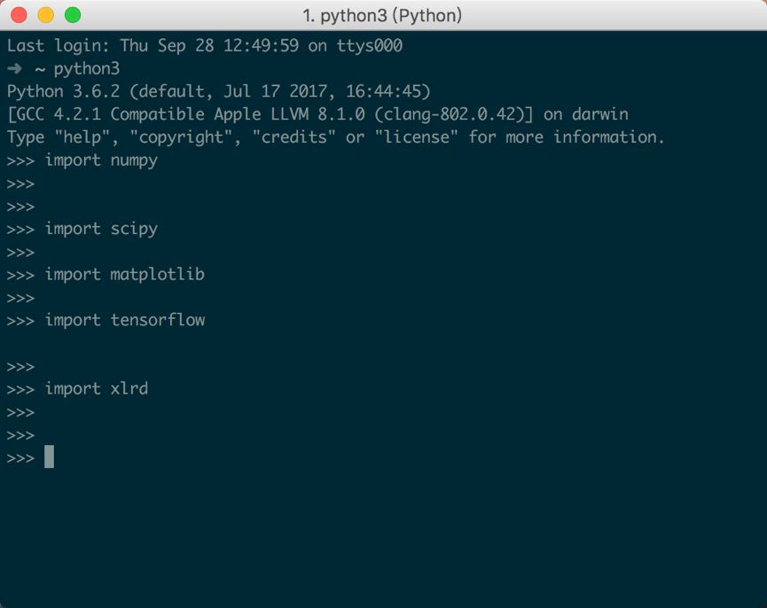
没有报错。

### 测试NumPy

#### 测试代码
```Python
import numpy as np

data = [6, 7, 8, 0, 1]
# 创建一维数组
arr = np.array(data)
print(arr)
```

#### 测试结果
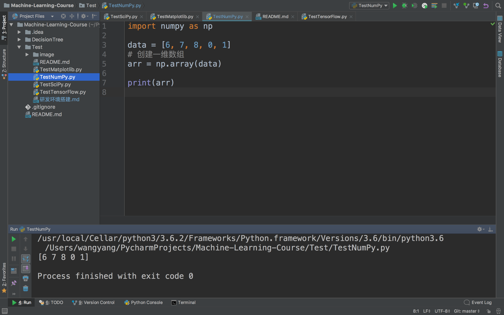


### 测试TensorFlow

### 测试代码
```Python
import tensorflow as tf
import numpy as np

x = np.array([[1, 1, 1], [1, -8, 1], [1, 1, 1]])
w = tf.Variable(initial_value=x)
sess = tf.Session()
sess.run(tf.global_variables_initializer())
print(sess.run(w))
```
#### 测试结果
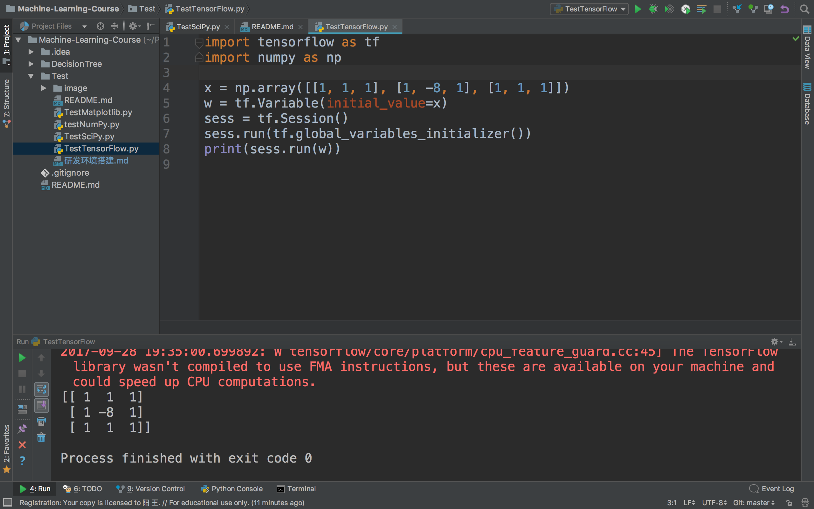

### 测试matplotlib

### 测试代码
```Python
from matplotlib.pyplot import *

n = 1024
X = np.random.normal(0, 1, n)
Y = np.random.normal(0, 1, n)
T = np.arctan2(Y, X)
scatter(X, Y, s=75, c=T, alpha=0.5)
xlim(-1.5, 1.5)
ylim(-1.5, 1.5)
show()
```
#### 测试结果
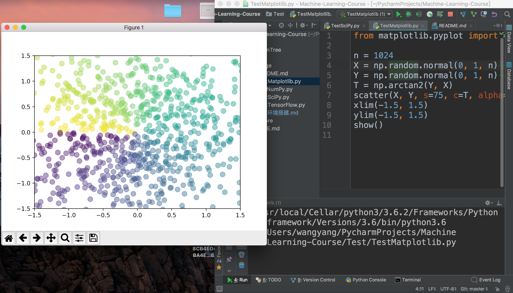

### 测试SciPy

### 测试代码
```Python
import numpy as np
from scipy.optimize import leastsq
import pylab as pl


def func(x, p):  # 这个函数就是我们要拟合的函数
    A, k, theta = p
    return A * np.sin(2 * np.pi * k * x + theta)


def errors(p, y, x):  # 这个定义的是拟合的原函数的误差值
    return y - func(x, p)


x = np.linspace(0, -2 * np.pi, 100)
# numpy中的linspace产生[0,-2pi]中的100个数（线性的）
A, k, theta = [10, 0.34, np.pi / 6]
# 原函数的三个参数
y0 = func(x, [A, k, theta])
# 真实的数据集

y1 = y0 + 2 * np.random.randn(len(x))
# 加入噪声的数据集
p0 = [2, 0.2, np.pi]
plsq = leastsq(errors, p0, args=(y1, x))
# 通过优化函数leastsq进行迭代优化

print("real parameters:", [A, k, theta])
print("matching parameters:", plsq[0])

pl.plot(x, y0, 'bo', label="real data")
pl.plot(x, y1, 'r1', label="matching data")
pl.plot(x, func(x, plsq[0]), label='matching curve')
pl.legend()
pl.show()  # 可视化
```

#### 测试结果
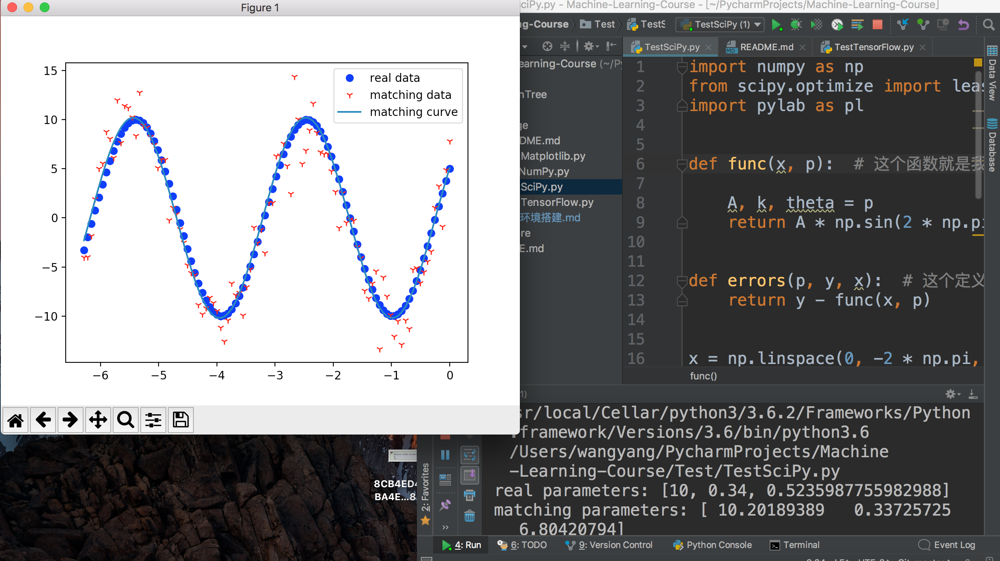
